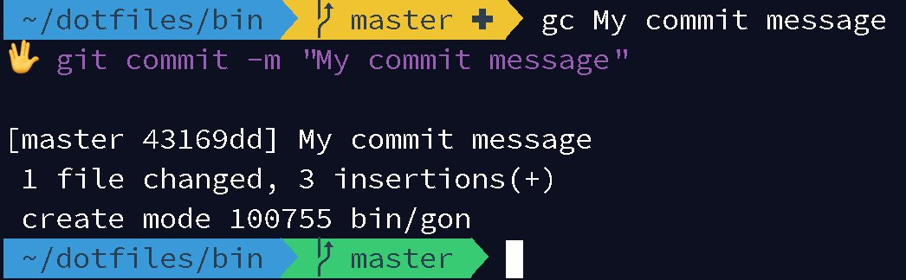

# Git Spock

Pretty Git short-commands for your terminal.

## Command List

- ga - `git add -A -v` | `git add $@ -v`
- gp - `git push`
- gl - `git pull`
- gf - `git fetch`
- gb - `git branch`
- gc - `git commit -m "$@"`
- gam - `git commit --amend -m "$@"`
- gd - `git diff` | `git diff $@`
- gs - `git status`
- gpom - `git push origin master`
- glom - `git pull origin master`
- gk - `git checkout $@`
- gon - `git clone $@`
- gao - `git remote add origin $@`
- gas - `git stash $@`
- gasp - `git stash apply stash@{$1}`

## Install Steps

1. Clone this repo
1. Add the bin directory to your path
1. Source your terminal
1. `chmod +x bin/*`
1. Start using the commands above!